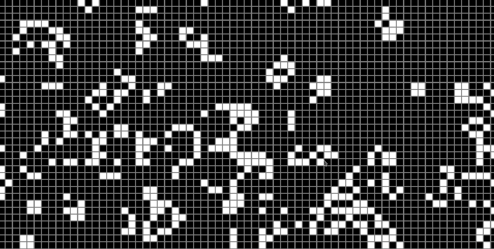

# Fast Game of Life
## Build Instructions
* `cargo run --release` not running on release will make it slow...

## Description

* Conway's Game of Life implemented using [ggez](https://github.com/ggez/ggez)
* Default runs on 2000 by 2000 grid(modfiy `GRID_SIZE` global variable to change)
* Can use arrow keys to move around the grid, as 2000 cells probably will not fit on your computer screen(modify `WINDOW_WIDTH` and `WINDOW_HEIGHT` globals to change to screen of your monitor)
* Some predefined patterns(look in `src/patterns.rs`) for more details
* Can choose run of number of threads of your choosing(`Backend::MultiThreaded(num_threads)`) or just have program figure it out by using the [rayon](https://github.com/rayon-rs/rayon) data parallelism library(`Backend::Rayon`)

* See example below for more details

```
pub fn main() -> GameResult {
    // ************  GRID  ************   
    // NOTE: all patterns start drawing from the top leftmost corner of the
    // "smallest bounding rectangle" of the pattern
    let start_point = (0,150);
    let mut init_b_matrix_vector = patterns::PatternBuilder::new()
        //.make_square(0,0)
        //.make_blinker(5,5)
        //.make_t(12,12)
        //.make_r_pentomino(30,30)
        //.make_glider(60,60)
        //.make_random(start_point,400,500)
        .make_random((0,0),GRID_SIZE,GRID_SIZE)
        .build();
    // ************  GGEZ  ************   
    let cb = ggez::ContextBuilder::new("super_simple", "ggez").window_mode(
        conf::WindowMode::default()
            .resizable(true)
            .dimensions(WINDOW_WIDTH as f32, WINDOW_HEIGHT as f32),
    );

    // ************  RUNNING  ************   
    let (ref mut ctx, ref mut event_loop) = cb.build()?;
    graphics::set_blend_mode(ctx,BlendMode::Replace)?;

    // default offset start at (0,0), but can change if you want
    // Note these numbers must be positive or will panic
    let origin_point = 0.1 as f32;
    //let update_method = Backend::MultiThreaded(8);
    //let update_method = Backend::Single;
    let update_method = Backend::Rayon;
    let ref mut state = Grid::new(ctx,update_method)?
        .init_seed(init_b_matrix_vector)
        .init_offset(origin_point,origin_point);
    event::run(ctx, event_loop, state)
}
```

## Future TODO
* refactor with traits to get rid of deref anti-pattern
